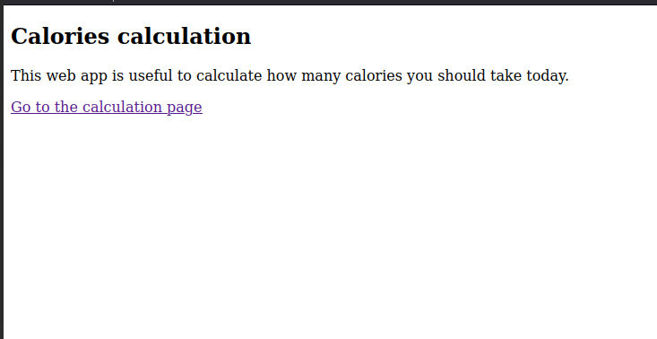
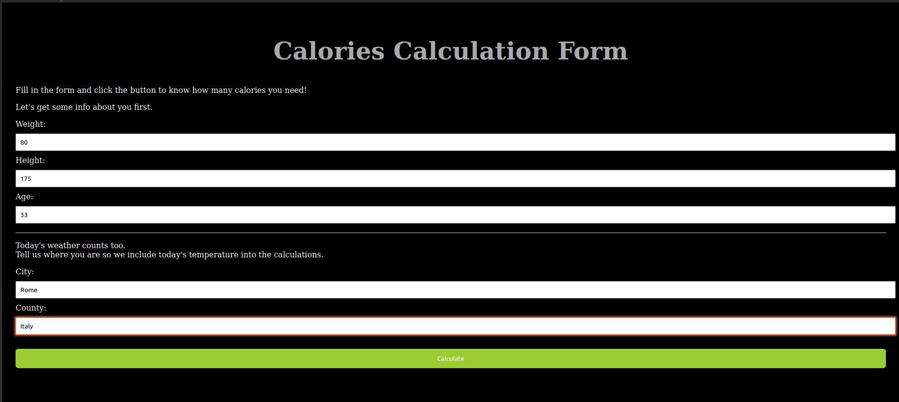
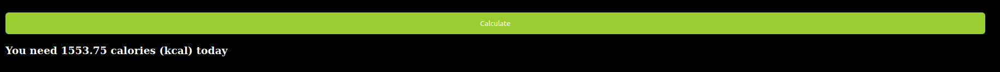

<h1> Counting calories webbapp </h1> 
<h2> About project: </h2> 

 In this project i try to implement easy web form for counting how many calories you should get. I am using OOP
principes and i try to implement some cybersecurity principles to prevent attacks. Also using Flask framework and web scraping
by BeautifulSoup library.

 
<h3> Scraping temperature: </h3> 

 In this project app scrape actual temperature in city from <italic>www.timeanddate.com/weather.</italic> Temperature is
important to get calculation on <bold>BMR</bold>
 

 BMR formula: (10*weight) + (6.25*height) - (5*age) + 5 -(10*temperature)

 
<h3> Security: </h3> 

 I tried to prevent some known attack to websites using libraries like 

 

Bleach: this library I used to sanitize users input to prevent some XSS attacks or Code Injections 

 

 Talisman: Talisman is a small Flask extension that handles setting HTTP headers that can help protect against a few common web application security issues.

 
<h2> Libraries: </h2>

 All used libraries and their versions you can find in requirements.txt file. 

<h2> Showcase: </h2> 
At start you will get to the homepage
 

 
After clicking on link you will be redirected on form, where app needs some your information to get results.
 

 

And finally after clicking to "Calculate" button you will get the result shown bellow

